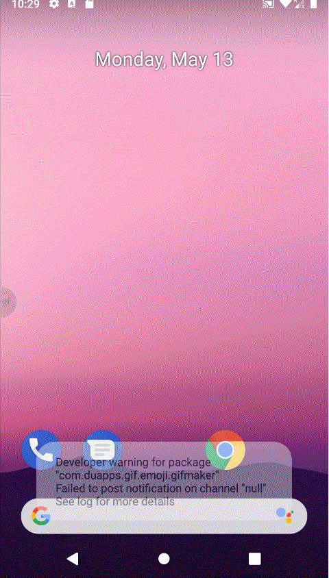

# Welcome to the Car Reseller App!

This app was created as part of a challenge, I had to create an app that goes through 3 steps consuming REST APIs to filter data and bring it to a final result screen. No design spec was given so I had the freedom to create my own design. 

As a plus, the app is covered by unit and instrumented tests. And last but no least, it's *no surprise* that the app was written in **Kotlin**

## Before you run this
When you have downloaded the project, in the app **build.gradle**, replace the following:

**MY_AWESOME_KEY** to your key. Example: *dsadsad-dsadsad-dsadsad-dsadsad* 
**MY_AWESOME_BASE_URL/v1/** to the service URL. Example: *http://myapi.com/v1/*

Also, in order to run instrumentation tests, you must change the build variant to **instrumentationTest**.

After this, have fun!

## More Details
- Built using MVP with clean architecture;
- Dependency Injection is made using **Koin 2**;
- **@Parcelize** - an experimental Kotlin feature - is used to reduce Parcelable boilerplate code;
- **Lottie** is used to run animations;
-  **RxJava2** is used together with **Retrofit2** to make API calls;
- App supports android 16;
- **MockWebServer** is used for the instrumentation tests, if you don't have the access to run the app, you can see it running through it.

## Demo
                       

